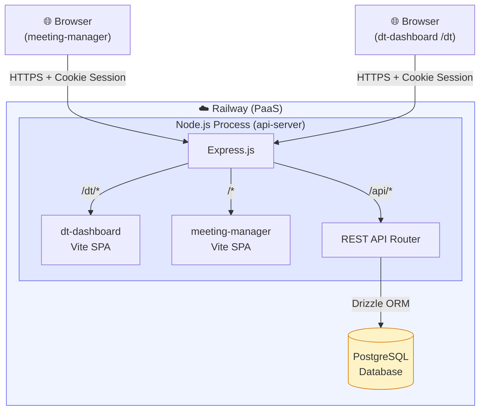
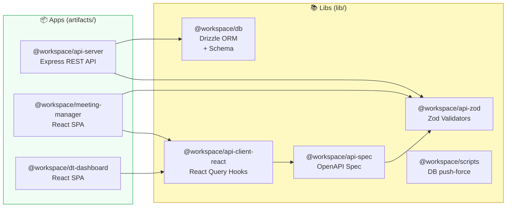
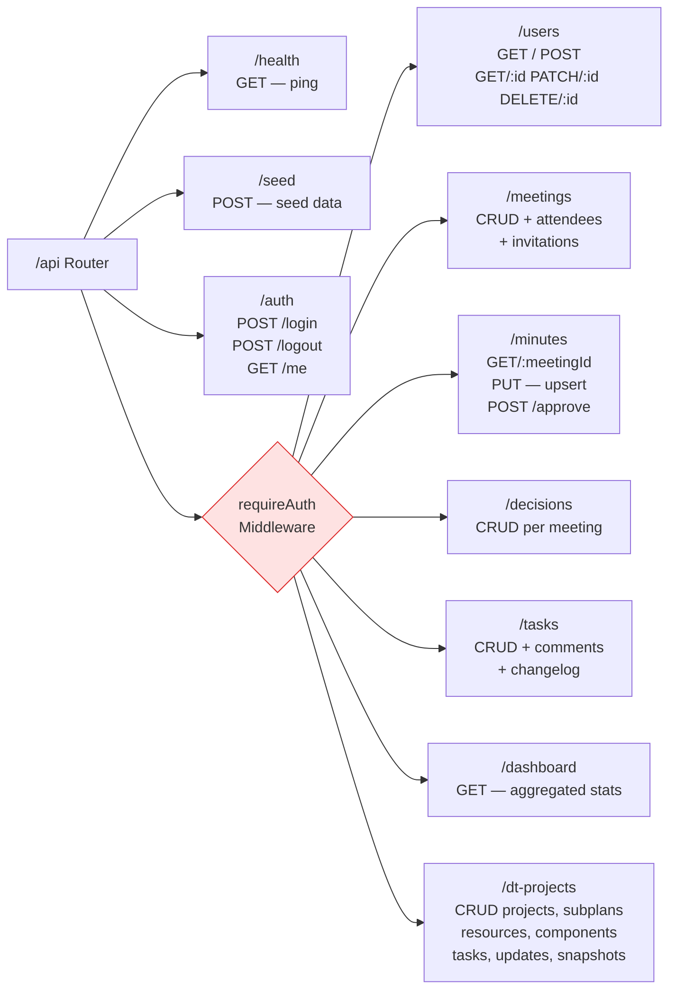
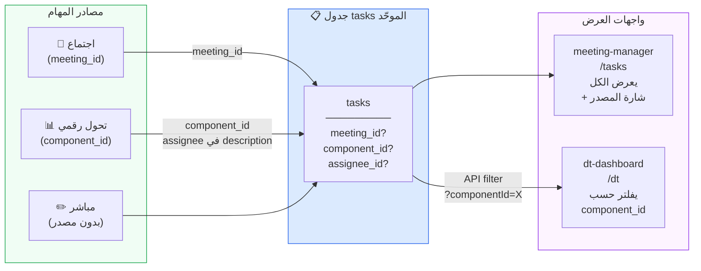
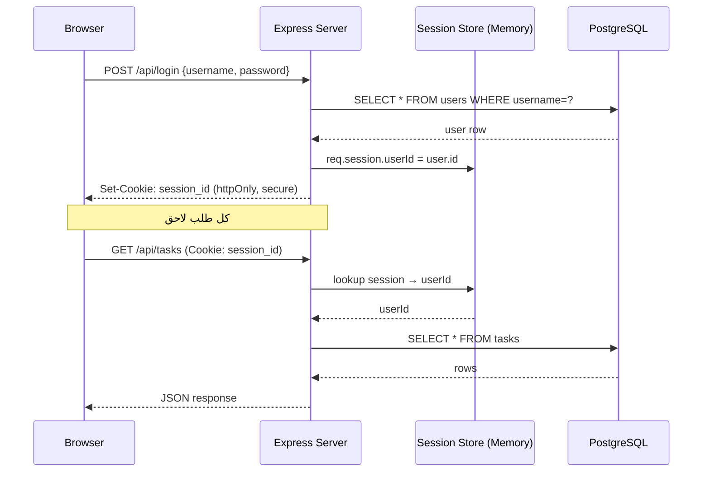

# مخطط النظام المنطقي — Meeting Manager

---

## 1. المعمارية العليا (High-Level Architecture)



---

## 2. طبقة الـ Monorepo Packages



---

## 3. API Routes (كل شيء تحت /api)



---

## 4. قاعدة البيانات — العلاقات (Entity Relationship)

```mermaid
erDiagram
    users {
        serial id PK
        text username UK
        text full_name
        text email
        text role
        text department
    }

    meetings {
        serial id PK
        text title
        date date
        text status
        text project
        text team
        integer chairperson_id FK
        text[] agenda_items
    }

    meeting_attendees {
        serial id PK
        integer meeting_id FK
        integer user_id FK
    }

    minutes {
        serial id PK
        integer meeting_id FK_UK
        text executive_summary
        text discussion_items
        text status
        integer approved_by_id FK
    }

    decisions {
        serial id PK
        integer meeting_id FK
        text agenda_item
        text content
    }

    tasks {
        serial id PK
        text title
        text status
        text priority
        integer completion_percent
        date due_date
        integer meeting_id FK
        integer decision_id FK
        integer assignee_id FK
        integer component_id FK
        text[] tags
    }

    task_comments {
        serial id PK
        integer task_id FK
        text content
        integer author_id FK
    }

    task_changelog {
        serial id PK
        integer task_id FK
        text field
        text old_value
        text new_value
        integer changed_by_id FK
    }

    dt_projects {
        serial id PK
        text title
        date deadline
    }

    dt_subplans {
        serial id PK
        integer project_id FK
        text title
        text status
        integer progress
        date deadline
    }

    dt_resources {
        serial id PK
        integer subplan_id FK
        text name
        text role
        integer allocation
    }

    dt_components {
        serial id PK
        integer subplan_id FK
        text driver
        text title
        text priority
    }

    dt_task_updates {
        serial id PK
        integer task_id FK
        text note
        text by
    }

    dt_snapshots {
        serial id PK
        integer project_id FK
        text label
        jsonb metrics
    }

    users ||--o{ meetings : "chairperson"
    users ||--o{ meeting_attendees : "attends"
    meetings ||--o{ meeting_attendees : "has"
    meetings ||--|| minutes : "has"
    meetings ||--o{ decisions : "produces"
    meetings ||--o{ tasks : "generates"
    decisions ||--o{ tasks : "linked"
    users ||--o{ tasks : "assigned"
    tasks ||--o{ task_comments : "has"
    tasks ||--o{ task_changelog : "tracked"
    tasks ||--o{ dt_task_updates : "DT updates"
    users ||--o{ task_comments : "writes"
    users ||--o{ task_changelog : "changes"
    minutes }o--|| users : "approved_by"

    dt_projects ||--o{ dt_subplans : "contains"
    dt_projects ||--o{ dt_snapshots : "snapshots"
    dt_subplans ||--o{ dt_resources : "has"
    dt_subplans ||--o{ dt_components : "has"
    dt_components ||--o{ tasks : "linked via component_id"
```

---

## 5. تدفق البيانات — المهام الموحّدة



---

## 6. نظام Auth والجلسات



---

## ملخص المكوّنات

| المكوّن | النوع | يخدم |
|---------|-------|-------|
| Express.js | Web Server | كل شيء |
| meeting-manager SPA | React + Vite | `/` |
| dt-dashboard SPA | React + Vite | `/dt` |
| REST API | Express Router | `/api/*` |
| PostgreSQL | Database | كل البيانات |
| Drizzle ORM | DB Client | داخل api-server |
| Session Cookie | Auth | مشترك بين الـ SPAs |
| Railway | PaaS Host | الإنتاج |
